# Exercice 1 : Modification IP client serveur (temps estimé : 1h)

## Pratique

Q.1.1 Sans changer les adresses IPv4 des 2 machines, montre et explique le résultat d'un ping IPv4 du serveur vers le client.

Côté serveur :

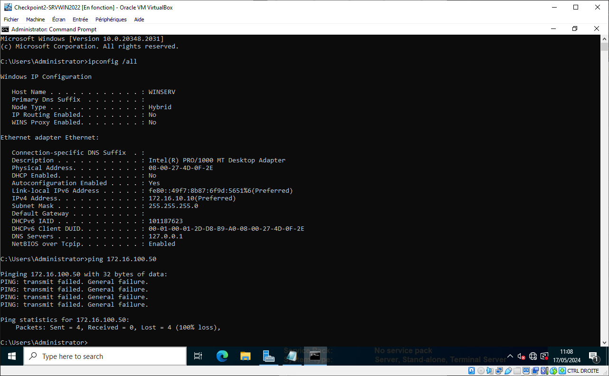

Côté Client :

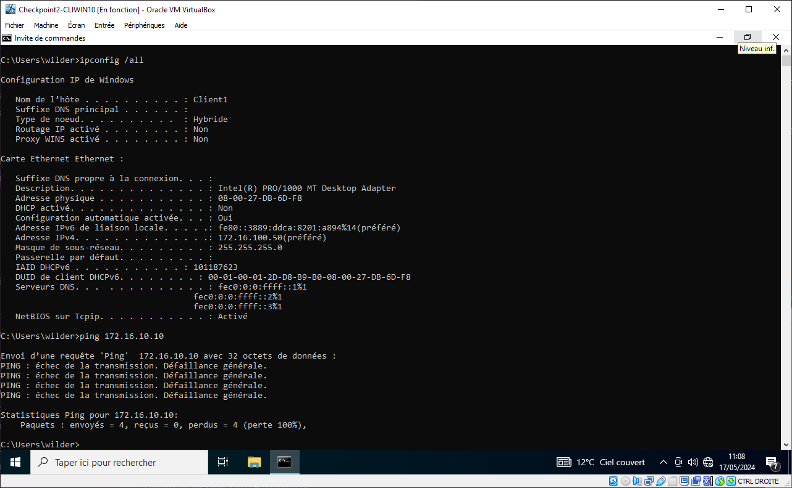

Il n'y a pas de communication entre le Serveur et le Client, les requêtes de ping n'aboutissent pas

Fais une modification de la configuration IP sur le client pour que ce ping IPv4 fonctionne.
Montre le changement effectué.
Montre un ping fonctionnel.

Afin de pouvoir joindre le Serveur à partir du Client, nous devons modifier l'IP fixe pour être dans le même réseau que le Serveur

Nous allons paramètrer l'IP du Client avec l'IP `172.16.10.20/24`

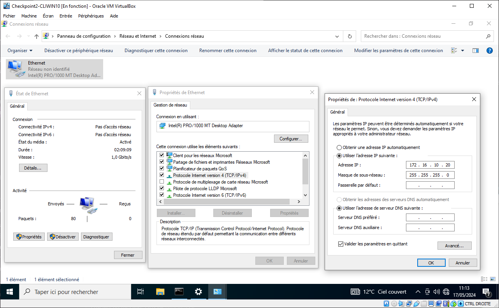

Après modification, nous pouvons refaire la requête de ping qui cette fois-ci aboutie

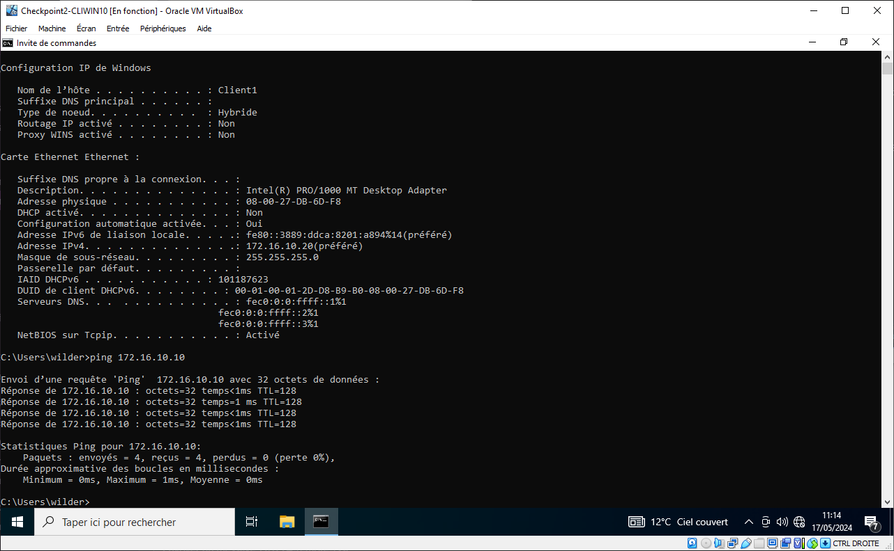

Q.1.2 Montre et explique le résultat d'un ping du serveur vers le client avec le nom des machines.

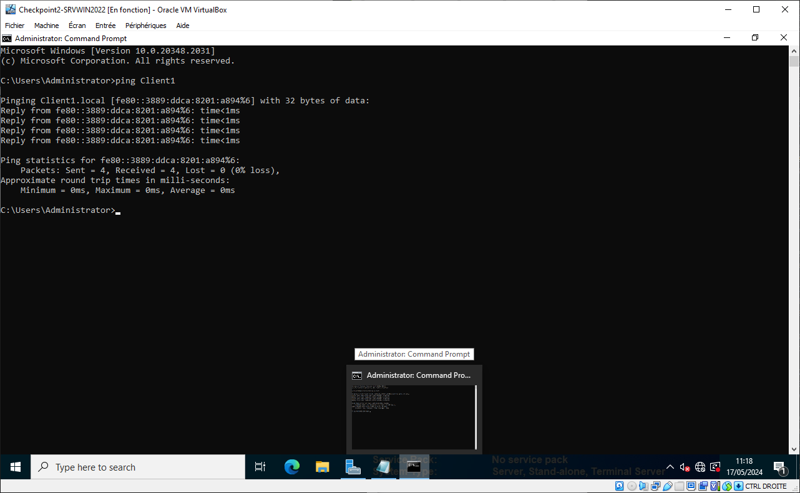

Le ping avec le nom du matériel a réussi étant donné que les deux matériels sont désormais sur le même réseau.

Q.1.3 Désactive le protocole IPv6 sur le client.
Refais un ping avec le nom des machines du serveur vers le client.
Explique le résultat.
Fais une modification sur le client et/ou sur le serveur pour que ce ping fonctionne.
Montre tes modifications et un ping fonctionnel.

Après désactivation de l'IPv6 sur le Client, le ping est toujours fonctionnel et prend désormais en compte l'IPv4.

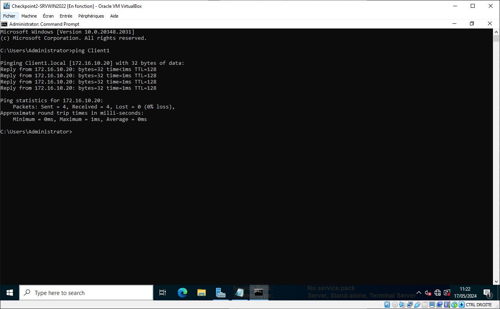

Q.1.4 Change et montre les configurations réseaux sur le client et/ou sur le serveur pour mettre en place le DHCP.

Le Serveur possède déjà le rôle DHCP, une étendue est configuré comprenant 2 plages d'exclusion.

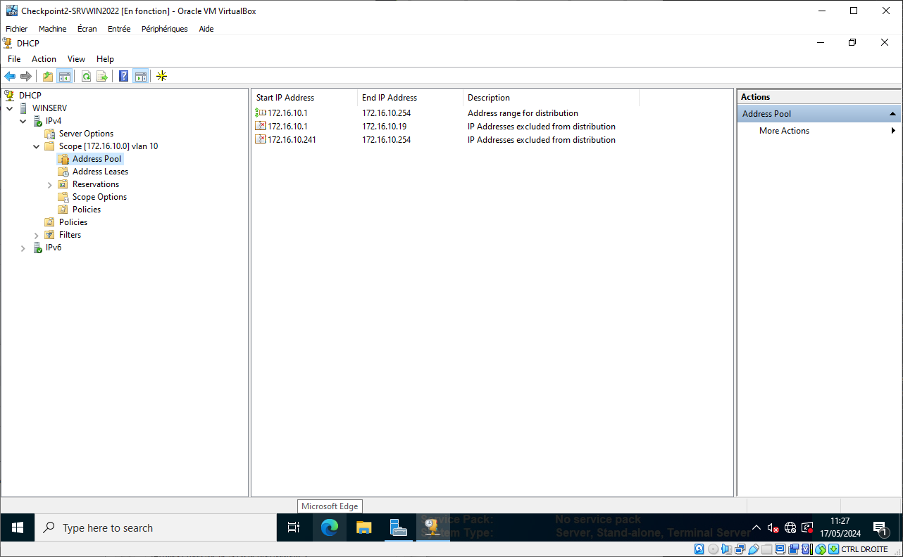

Nous devons alors configurer la carte réseau en automatique afin que le lien s'établisse entre le Serveur et le Client via le Protocole DHCP.

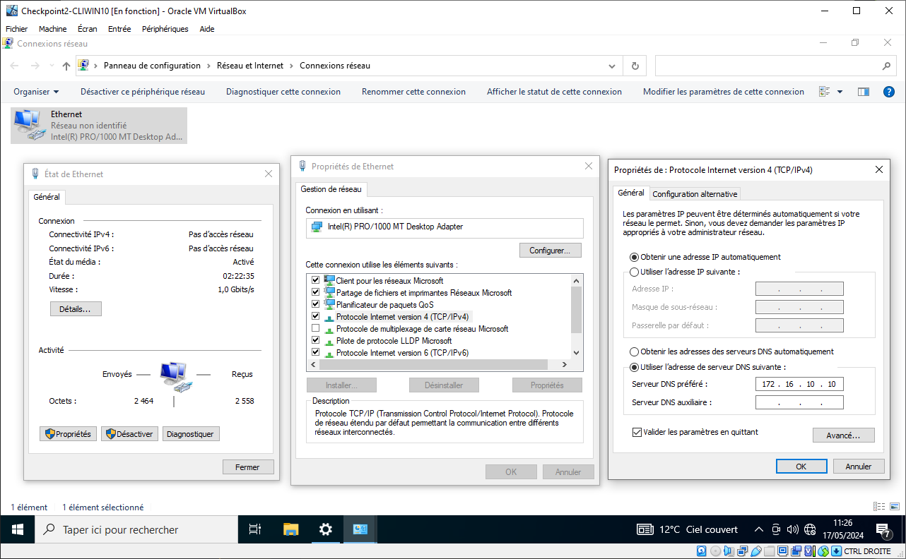

La communication a bien abouti, l'IP `172.16.10.20/24` a été attribué au Client.

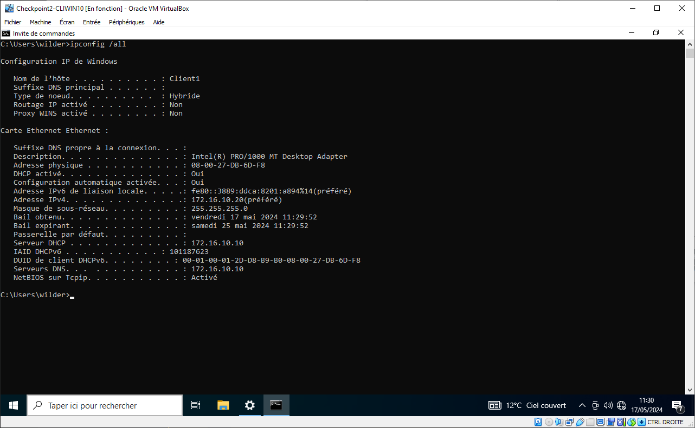

Q.1.5 Explique pourquoi le client ne récupère pas la 1ère adresse disponible sur cette plage.
Fais une copie d'écran montrant l'adresse IP prise par le client.

Comme dit précédemment, une plage d'exclusion a été créé, elle commence à l'IP `172.16.10.1` et se termine à l'IP `172.16.10.19`.

La première adresse disponible dans l'étendue est par conséquent l'IP `172.16.10.20` qui a été attribué à notre Client.

Q.1.6 Fais une modification sur le DHCP pour que le client ai l'adresse IP 172.16.10.15.
Montre tes modifications.

Nous devons dans un premier temps supprimer la plage d'exclusion comprenant l'IP `172.16.10.15`.

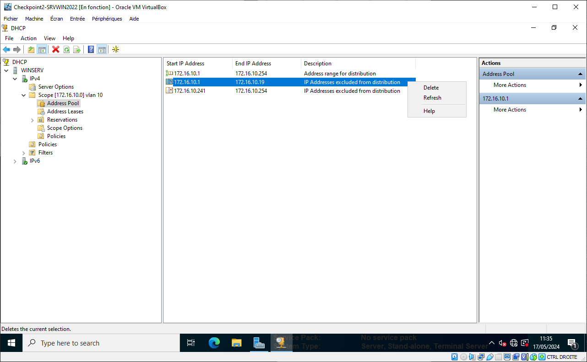

Ensuite, nous recréons une plage d'exclusion allant de `172.16.10.1` à `172.16.10.14`.

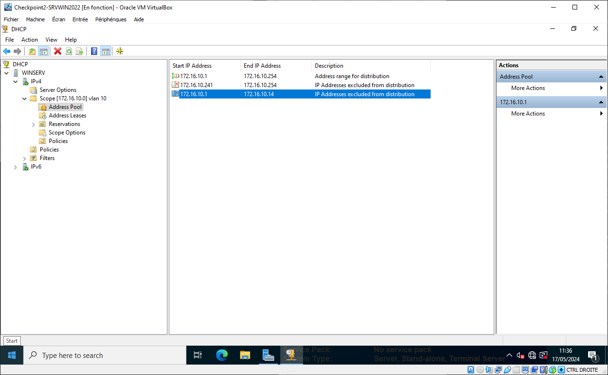

Côté Client, nous allons procéder à une libération de l'IP avec la comande `ipconfig /release`

Côté Serveur, nous supprimons la réservation de bail du Client pour l'IP `172.16.10.20`.

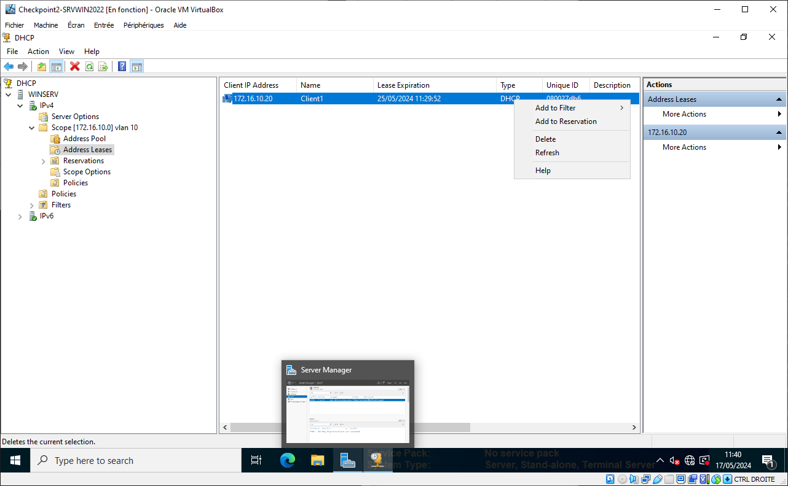

Nous redémarrons le Client, au démarrage l'IP `172.16.10.15` a bien été attribué par le Serveur.

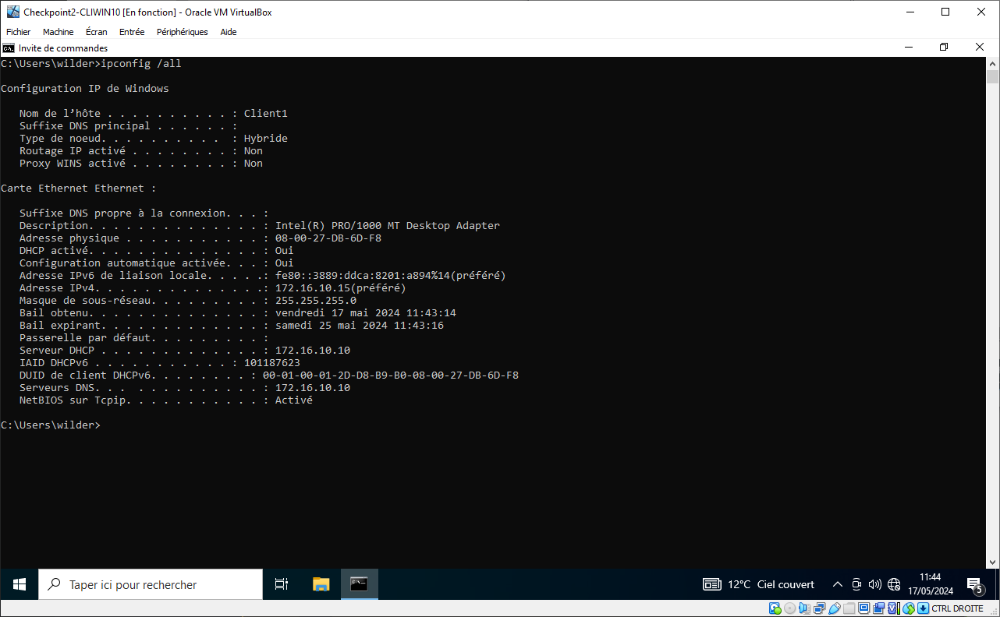

Q.1.7 Au vu de tes manipulations, explique l'intérêt de passer ce réseau en IPv6 ?

L'intérêt consiste à avoir une étendue beaucoup plus grande d'adresses disponibles que pour l'IPv4.

Q.1.8 Est-ce que dans ce cas le serveur DHCP est obsolète ?
Quelle modification peut-on faire sur le serveur DHCP pour qu'il reste actif et qu'il te permette de gérer les adresses IPv6 ?

En l'état actuel, le DHCP n'est pas configuré pour l'IPv6, nous devrions pour que cela fonctionne ajouter une étendue dans les paramètres DHCP IPv6 pour que cela fonctionne.

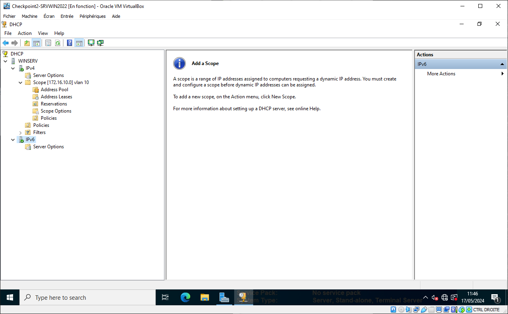